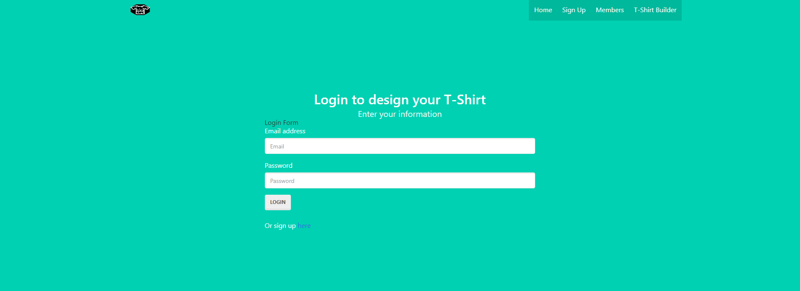

# Sweetest Tees T-Shirt Designer

### User Story  
◦AS young developers who love designing websites and T Shirts,  
◦WE want to make an app to create customizable T Shirts that include some of our favorite internet logos and icons.  
◦SO that we can address and enhance our style as web desginers.  

### Business Context
We think it is important for our users to be able to express their unique style and personality through what they wear. 
This is accomplished in the T-Shirt Builder part of the app, where users are allowed to explore various internet icons and put them on a T-Shirt.

### Description
A T-shirt Designing Application that allows the user to create a username and password. Once logged in the user will be able to see all previous tee shirts that they have created and update them if needed. We collect information on the user such as color of the shirt, and any additional logos or images they want to add to their design.

### Link
[Visit this website](https://sweetesttees.herokuapp.com/)

### Visuals
